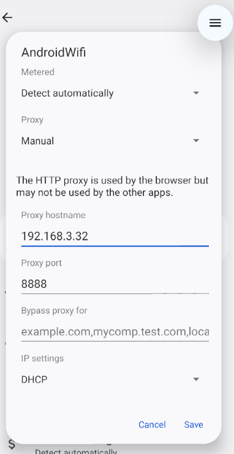
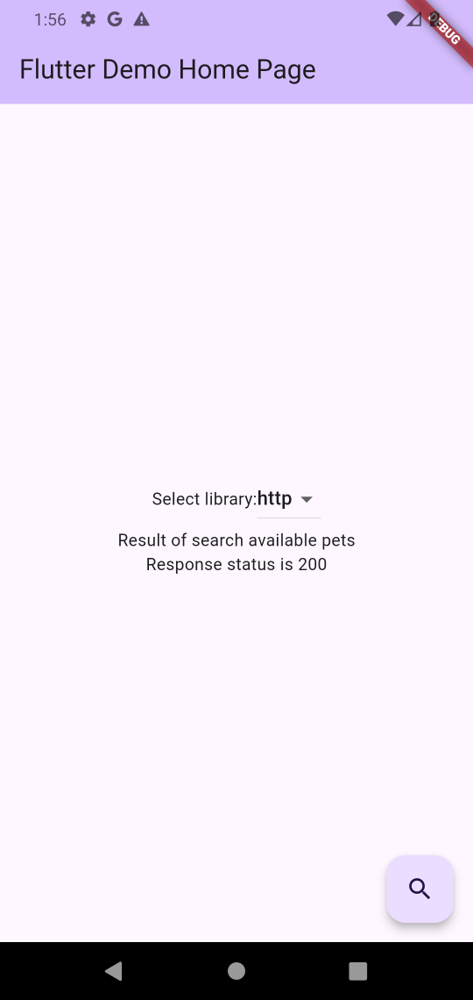
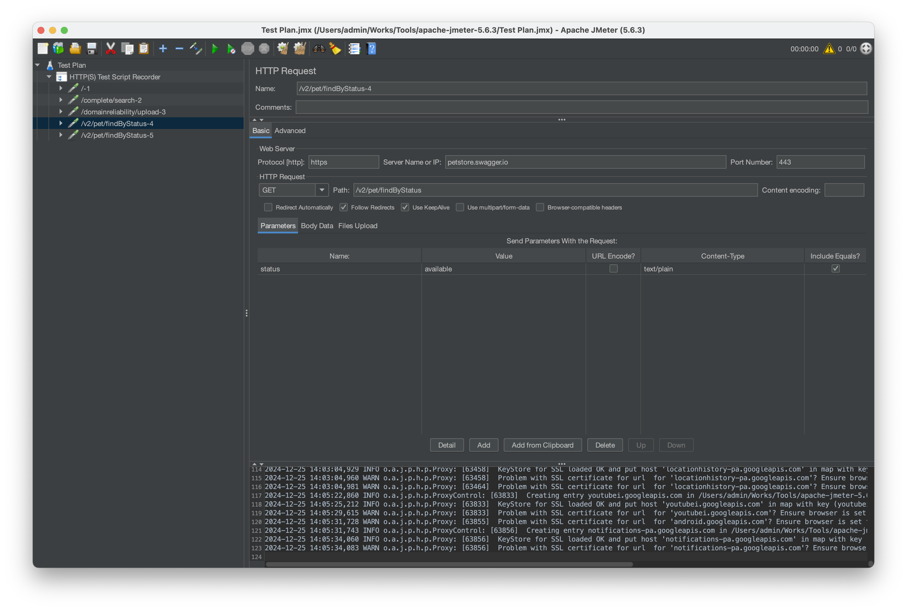

# Guide to Recording Test Scenarios with JMeter for Flutter Apps

## Foreword

Perhaps when performing a test scenario recording with JMeter for mobile applications in general, you have referred to one of the popular guides on the internet below:  
<https://medium.com/@viniciuscorrei/using-jmeter-to-record-test-scenarios-directly-from-mobile-applications-b5dc5bc48ef6>  
<https://blogs.perficient.com/2021/08/25/perform-load-test-on-mobile-app-using-apache-jmeter/>

And maybe, like us, even though you followed the instructions correctly, the result was that JMeter couldn't record the requests sent from the mobile app to your server.
So, what is the reason? After some time researching, we found the answer to this issue (see detailed explanation below).

## Problem resolve

### Root cause: Flutter uses Dart which is not proxy-aware

The primary reason JMeter cannot record requests from your mobile app to the server is that Flutter uses Dart, which is not proxy-aware.
JMeter operates by creating a proxy server, through which your mobile app connects to the internet. This setup allows JMeter to capture and record the requests sent by the mobile app.  
However, by default, Flutter apps do not use the proxy server configured in the system settings. As a result, configuring the proxy as instructed will have no effect on Flutter apps.

### Solution

The simple solution is to explicitly configure the proxy server for the Flutter app, in addition to following the general instructions. Below is a guide for using popular libraries to connect to the server in Flutter.

#### `http`

1. Add the following libraries

    ```bash
    flutter pub add http
    flutter pub add system_proxy
    ```

1. Retrieve the system proxy and configure it for the Flutter app

    ```dart
    class ProxiedHttpOverrides extends HttpOverrides {
        final String _port;
        final String _host;
        ProxiedHttpOverrides(this._host, this._port);

        @override
        HttpClient createHttpClient(SecurityContext? context) {
            return super.createHttpClient(context)
            // set proxy
            ..findProxy = (uri) {
                return 'PROXY $_host:$_port';
            }
            ..badCertificateCallback = (X509Certificate cert, String host, int port) => true;
        }
    }


    void main() async {
        WidgetsFlutterBinding.ensureInitialized();

        Map<String, String>? proxy = await SystemProxy.getProxySettings();
        if (proxy != null) {
            HttpOverrides.global = ProxiedHttpOverrides(proxy['host']!, proxy['port']!);
        }

        runApp(MyApp());
    }
    ```

    **Note:** The following line of code is required for using the self-signed certificates generated by JMeter

    ```dart
    ..badCertificateCallback = (X509Certificate cert, String host, int port) => true;
    ```

1. Perform a request from the mobile app to the API

    ```dart
    const url = 'https://petstore.swagger.io/v2/pet/findByStatus?status=available';
    await http.get(Uri.parse(url));
    ```

#### dio

1. Add the following libraries

    ```bash
    flutter pub add dio
    flutter pub add system_proxy
    ```

1. Retrieve the system proxy and configure it for the Flutter app

    ```dart
    class ProxiedHttpOverrides extends HttpOverrides {
        final String _port;
        final String _host;
        ProxiedHttpOverrides(this._host, this._port);

        @override
        HttpClient createHttpClient(SecurityContext? context) {
            return super.createHttpClient(context)
            // set proxy
            ..findProxy = (uri) {
                return 'PROXY $_host:$_port';
            }
            ..badCertificateCallback = (X509Certificate cert, String host, int port) => true;
        }
    }

    void main() async {
        WidgetsFlutterBinding.ensureInitialized();

        Map<String, String>? proxy = await SystemProxy.getProxySettings();
        if (proxy != null) {
            final httpOverrides = ProxiedHttpOverrides(proxy['host']!, proxy['port']!);

            dio.httpClientAdapter = IOHttpClientAdapter()
                ..createHttpClient = () {
                    return httpOverrides.createHttpClient(null);
                };
        }

        runApp(MyApp());
    }
    ```

    **Note:** The following line of code is required for using the self-signed certificates generated by JMeter

    ```dart
    ..badCertificateCallback = (X509Certificate cert, String host, int port) => true;
    ```

1. Perform a request from the mobile app to the API

    ```dart
    const url = 'https://petstore.swagger.io/v2/pet/findByStatus?status=available';
    await dio.get(url);
    ```

### Results on the example app which we provide

1. Configure the proxy with the JMeter server

    

1. Select a library and perform the request

    

1. Confirm that the request has been recorded in JMeter

    
