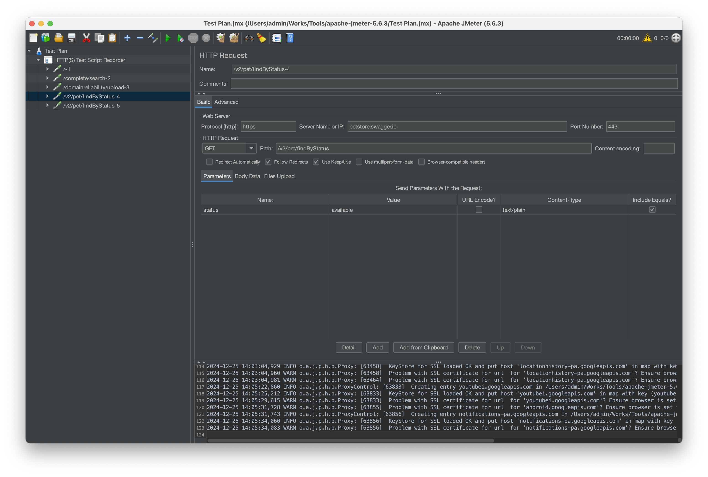

# Hướng dẫn record test scenario với JMeter cho Flutter app

## Đặt vấn đề

Có lẽ khi thực hiện record test scenario với JMeter cho mobile nói chung, các bạn đã tham khảo 1 trong các hướng dẫn phổ biến trên internet dưới dây.
<https://medium.com/@viniciuscorrei/using-jmeter-to-record-test-scenarios-directly-from-mobile-applications-b5dc5bc48ef6>
<https://blogs.perficient.com/2021/08/25/perform-load-test-on-mobile-app-using-apache-jmeter/>

Và có thể là các bạn cũng giống như chúng tôi, dù đã thực hiện đúng như hướng dẫn nhưng kết quả là JMeter không thể record được các request được gửi từ mobile app đến phía server của các bạn.
Vậy nguyên nhân là do đâu, sau một thời gian tìm hiểu thì chúng tôi đã có câu trả lời cho vấn đề này (Xem thêm chi tiết giải thích ở phía dưới)

## Xử lý vấn đề

### Nguyên nhân chính: Flutter sử dụng Dart và không phải proxy-aware

Đúng vậy, nguyên nhân chính của việc JMeter không thể ghi nhận được các request từ mobile app của bạn đến server là việc Flutter sử dụng Dart và không phải là proxy-aware.
Vì cơ chế của JMeter là tạo ra 1 proxy server, sau đó mobile app của bạn sẽ kết nối tới internet thông qua prox server đó.
Từ đó cho khả năng JMeter có thể record được các request mà mobile app gửi đi.
Tuy nhiên do Flutter app mặc định không sử dụng proxy server đã được cấu hình trong Settings của hệ thống vì vậy việc setting proxy theo hướng dẫn sẽ không có hiệu lực đối với Flutter app.

### Giải pháp

Giải pháp đơn giản là ngoài việc thực hiện theo hướng dẫn thì các bạn cần chỉ định 1 cách tường minh setting proxy server cho Flutter app.
Dưới đây là hướng dẫn của chúng tôi dành cho việc sử dụng các thư viện kết nối tới server phổ biến trên Flutter

#### `http`

1. Add thêm các thư viện dưới đây

    ```bash
    flutter pub add http
    flutter pub add system_proxy
    ```

1. Get system proxy và setting cho Flutter app

    ```dart
    class ProxiedHttpOverrides extends HttpOverrides {
        final String _port;
        final String _host;
        ProxiedHttpOverrides(this._host, this._port);

        @override
        HttpClient createHttpClient(SecurityContext? context) {
            return super.createHttpClient(context)
            // set proxy
            ..findProxy = (uri) {
                return 'PROXY $_host:$_port';
            }
            ..badCertificateCallback = (X509Certificate cert, String host, int port) => true;
        }
    }


    void main() async {
        WidgetsFlutterBinding.ensureInitialized();

        Map<String, String>? proxy = await SystemProxy.getProxySettings();
        if (proxy != null) {
            HttpOverrides.global = ProxiedHttpOverrides(proxy['host']!, proxy['port']!);
        }

        runApp(MyApp());
    }
    ```

    **Lưu ý:** Đoạn code dưới là bắt buộc cho việc sử dụng sefl-signed certificated mà được JMeter tạo ra

    ```dart
    ..badCertificateCallback = (X509Certificate cert, String host, int port) => true;
    ```

1. Thực hiện request từ mobile app đến API

    ```dart
    const url = 'https://petstore.swagger.io/v2/pet/findByStatus?status=available';
    await http.get(Uri.parse(url));
    ```

#### dio

1. Add thêm các thư viện dưới đây

    ```bash
    flutter pub add dio
    flutter pub add system_proxy
    ```

1. Get system proxy và setting cho Flutter app

    ```dart
    class ProxiedHttpOverrides extends HttpOverrides {
        final String _port;
        final String _host;
        ProxiedHttpOverrides(this._host, this._port);

        @override
        HttpClient createHttpClient(SecurityContext? context) {
            return super.createHttpClient(context)
            // set proxy
            ..findProxy = (uri) {
                return 'PROXY $_host:$_port';
            }
            ..badCertificateCallback = (X509Certificate cert, String host, int port) => true;
        }
    }

    void main() async {
        WidgetsFlutterBinding.ensureInitialized();

        Map<String, String>? proxy = await SystemProxy.getProxySettings();
        if (proxy != null) {
            final httpOverrides = ProxiedHttpOverrides(proxy['host']!, proxy['port']!);

            dio.httpClientAdapter = IOHttpClientAdapter()
                ..createHttpClient = () {
                    return httpOverrides.createHttpClient(null);
                };
        }

        runApp(MyApp());
    }
    ```

    **Lưu ý:** Đoạn code dưới là bắt buộc cho việc sử dụng sefl-signed certificated mà được JMeter tạo ra

    ```dart
    ..badCertificateCallback = (X509Certificate cert, String host, int port) => true;
    ```

1. Thực hiện request từ mobile app đến API

    ```dart
    const url = 'https://petstore.swagger.io/v2/pet/findByStatus?status=available';
    await dio.get(url);
    ```

### Kết quả trên example app mà chúng tôi đã cung cấp

1. Setting proxy với JMeter server
    

1. Lựa chọn thư viện và thực hiện request

    

1. Xác nhận kết quả request được record trên JMeter

    
